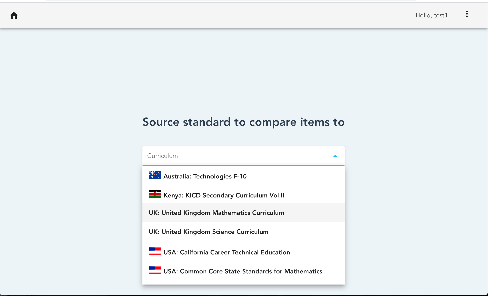
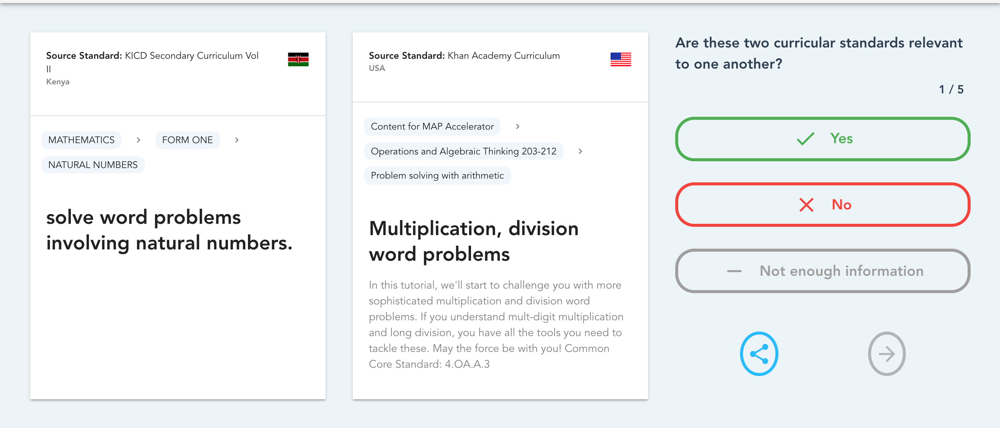
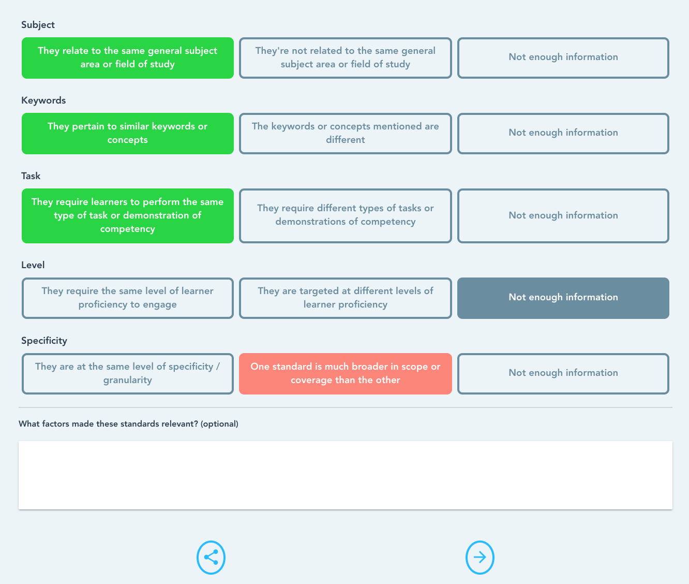

# Human Judgments Interfaces

This folder contains the source code of the custom user interface developed for
capturing how curriculum experts make similarity judgments between
curriculum standards.

The data collected is used to define machine learning model for automated matching.
For more information about this project, see [the report from the hackathon](https://learningequality.org/r/hackathon-oct19-report) where this user interface was developed.

## Live server

The live server used during the hackathon is accessible at [this link](http://alignmentapp.learningequality.org). Submitting alignment judgments requires registration
and filling out a user profile to indicate the areas of expertise.

## Screenshots

The screenshots below illustrate a sample user journey for providing human judgments
and illustrate the novel aspects of the interface.

### 1. Choosing a curriculum

After signing in, the first step for the users is to choose the curriculum for which
they want to provide alignment judgements:

  

The list includes all curriculum documents that were digitized during the event,
and include data manual entry, scraping websites, and structured data imports.

### 2. Making judgments

[Machine learning algorithms](https://tinyurl.com/hack-project4) running on the
server evaluate the similarities between different curriculum standards entries
and presents a pair of entries to the user asking them to evaluate how similar they are:

  

In the first step of the human feedback, the interface collects the basic information
whether the entries are similar (YES) or not (NO), and the option is give to not
answer in cases where information provided is not sufficient.

### 3. Adding nuanced information

Each human relevance judgment consists of a <b>rating</b> (numeric value between 0 and 1 that indicates the strength of the alignment) and a confidence level about the alignment judgment.

Through the direct collaboration between the domain experts (curriculum designers and educators)
and the machine learning, the interface was refined to collect much more detailed
information about the "dimensions" of alignment:

  

Collecting this nuanced information about subject, keyword, task, expected proficiency level,
and degree of specificity was determined to be an essential component for machine
learning solutions to be effective.

### Update Dec 2020

All data from this project and subsequent digitization efforts is available
on GitHub. See [github.com/rocdata](https://github.com/rocdata) for more info.

